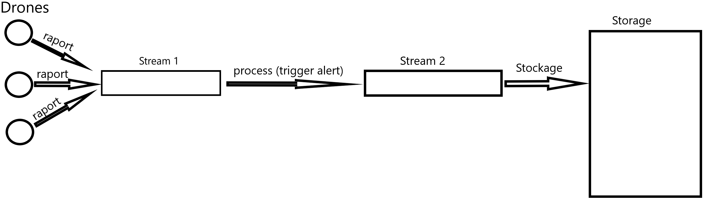

Data Engineering 

# 1) What technical/business constraints should the data storage component of the program architecture meet to fulfill the requirement described by the customer in paragraph «Statistics» ? 

Store 200 Gb each day with no loss. 

 

# So what kind of component(s) (listed in the lecture) will the architecture need? 

Stream 

 

# 2) What business constraint should the architecture meet to fulfill the requirement describe in the paragraph «Alert» 

React quickly in case of alert. 

 

# 3) What mistake(s) from Peaceland can explains the failed attempt? 

Not scalable.  

They didn’t use stream 

Dont have enough information 

# 4) Peaceland has likely forgotten some technical information in the report sent by the drone. In the future this information could help Peaceland make its peacewatchers much more efficient. Which information? 

HOUR/TIME 

So, we have 2 stream, the first stream receive the reports of the drone, then we can process for vérification of the report, if its is safe or note. So we place these verification in an other stream, at the end we stock in the storage. 

## Peut-être que je dis n'importe quoi mais je pense que mettre de la data dans une stream c'est rapide et la mettre dans une NoSQL c'est lent, 

## Du coup on store tout ce qui arrive dans une stream, puis un premier stream consumer vérifie si y a besoin de trigger une alerte, comme il a besoin d’etre rapide il se charge pas de stocker dans le NoSQL donc il envoie tout dans une autre stream. 

## Apres y’a un deuxième stream consumer qui vide la deuxième stream dans le NoSQL. 

Et ça satisfait ce que le prof a mis en bas : 

Based on the preliminary question your solution is very likely to include : 

● at least one distributed storage 

● at least one distributed stream 

● at least two stream consumer 

